# lab_4

Лабораторная работа 4

Цель настоящей работы состоит в том, чтобы построить архитектур  рекуррентных нейронных сетей, которые позволяют решить практическую задачу с высокими показателями качества.

Задачи

Выполнение практической работы предполагает решение следующих задач:

1. Разработка нескольких архитектур рекуррентных  нейронных сетей.

2. Обучение разработанных глубоких моделей.

3. Тестирование обученных глубоких моделей.

4. Сравнение полученных результатов с результатами 3 лабораторной работы.

5. Публикация разработанных программ/скриптов в личном репозитории на GitHub. (по желанию)

6. Подготовка отчета, содержащего минимальный объем информации по каждому этапу выполнения работы.

Код [ссылка](Лаб4.ipynb)

Отчет [ссылка](Отчет_Лаб4.docx)

Для работы Было использовано подмножество набора данных Food-101. (Bossard, Lukas, Matthieu Guillaumin и Luc Van Gool. "Food-101 – Mining Discriminative Components with Random Forests") https://www.kaggle.com/datasets/carlosrunner/pizza-not-pizza Изображения находятся в папке "img" в двух папках, "pizza" и "not_pizza", в каждой папке 983 файла с изображениями.

В ходе работы было создано несколько моделей:

1. Создание модели с рекуррентной архитектурой (LSTM)

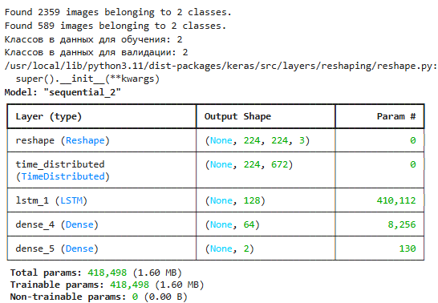

Точность на валидационной выборке: 66.72%

2. Создаём модель RNN

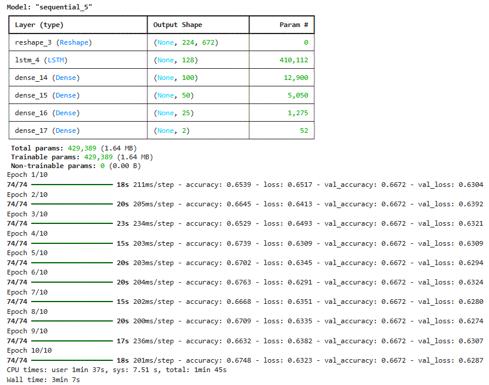

Анализ работы модели:

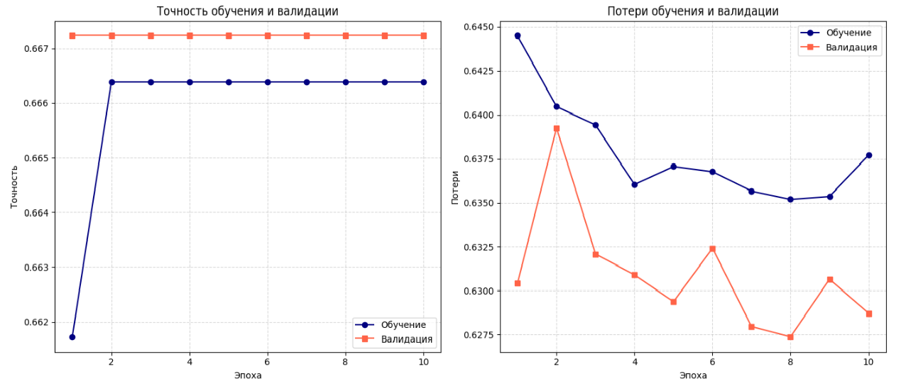

Выводы:

Точность (Accuracy): На графике точности синяя линия (обучающая выборка) стабильно растёт и достигает высоких значений (например, 0.85–0.95), это говорит о том, что нейросеть хорошо обучается на предоставленных данных. Однако, если оранжевая линия (валидационная выборка) значительно ниже (например, 0.6–0.75) или не растёт после первых эпох, это указывает на переобучение, и модель плохо обобщает на новые данные. Для RNN в задаче классификации изображений ожидаемая точность может быть ниже, чем у CNN. На сложных датасетах (например, CIFAR-10) типичная точность без доработок составляет 60–80%, на простых (например, MNIST) — до 95%. Если валидационная точность ниже 0.7, это низкий результат, требующий улучшений.

Потери (Loss): На графике потерь синяя линия (обучающая выборка) падает и стабилизируется на низком уровне (например, <0.3), это подтверждает успешное обучение. Если оранжевая линия (валидационная выборка) выше (например, >0.5) или начинает расти после нескольких эпох, это снова указывает на переобучение — модель теряет способность обобщать. В идеале обе линии должны быть близки и снижаться (например, обучающие потери 0.2, валидационные 0.25). Если разрыв между линиями велик, это негативно влияет на оценку работы модели.

3. Добавим сверточные слои:

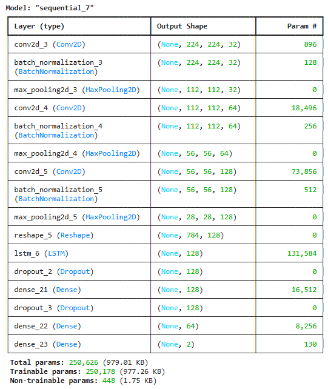

Анализ работы модели:
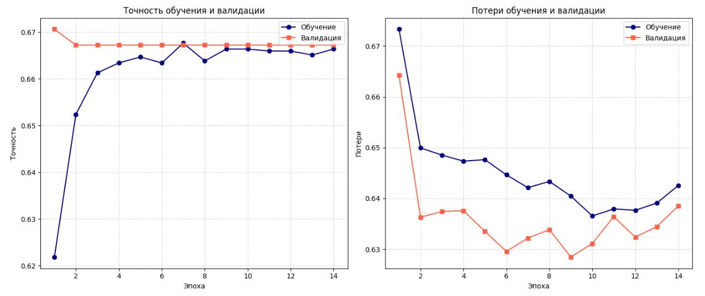

Тест подтверждает, что модель не обучается: точность минимально изменяется и находится близко к уровню случайного угадывания (0.666 ≈ 2/3, что может соответствовать задаче на 3 класса, если случайное угадывание для 3 классов равно 1/3, а модель показывает чуть лучший результат). Потери стабилизировались слишком рано, а "плоские" графики указывают на отсутствие прогресса в обучении. Вывод: Модель неэффективна в текущей конфигурации. Результаты близки к случайным, что говорит о фундаментальных проблемах либо в архитектуре модели, либо в данных, либо в настройках обучения.

4. Попробуем убрать LSTM-слой и использовать чистую CNN-архитектуру:

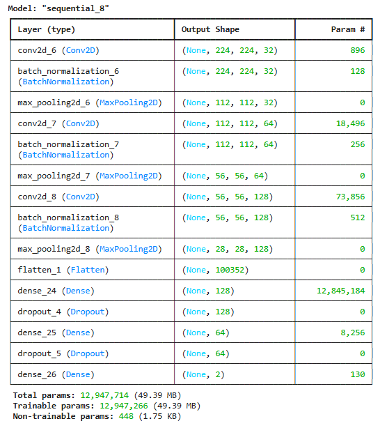

Анализ работы модели:
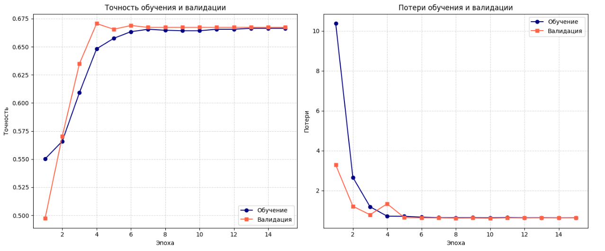

Выводы: в предыдущих версиях модели (с LSTM) точность была около 0.666, что близко к случайному угадыванию для задачи с 3 классами (или недостаточно высоко для 2 классов). После перехода к чистой CNN ожидается улучшение, так как CNN лучше подходит для классификации изображений. Время выполнения ("Wall time: 4min 11s") указывает на относительно быстрое обучение, что может быть результатом упрощения модели (удаление LSTM) или небольшого набора данных. Использование EarlyStopping (с patience=5) из кода должно было остановить обучение, если потери на валидации перестали уменьшаться, что могло повлиять на количество эпох на графиках.

Добавим аугментацию данных через ImageDataGenerator, чтобы повысить разнообразие. Усложним модель. Настроим параметры. Добавим метрики:
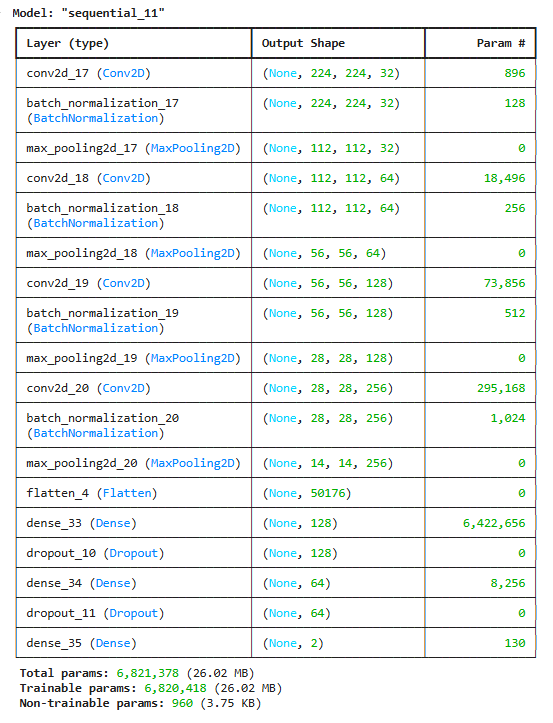

Анализ работы модели:

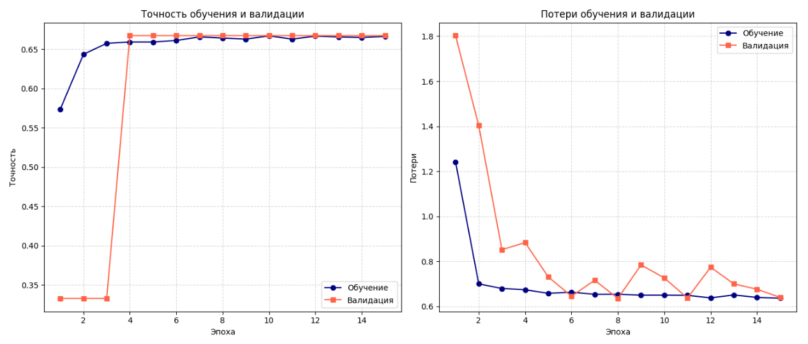

Выводы: Модель показывает умеренный прогресс (рост тренировочной точности и начальное улучшение валидационной), но застревает на низком уровне обобщения (0.6672). Это лучше, чем случайное угадывание, но далеко от желаемых результатов (0.85–0.9 для сложных датасетов). Отсутствие переобучения — плюс, но ограниченная способность к обобщению — серьёзный минус.

Добавим ещё один или два свёрточных слоя для извлечения более сложных признаков, так как текущая точность указывает на недостаточную глубину модели:

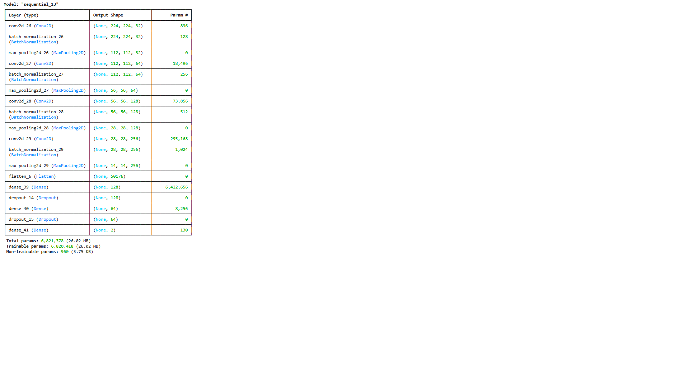

Анализ работы модели:

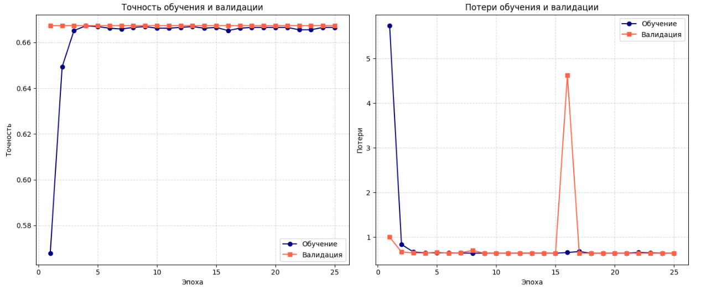

Выводы: Быстрый рост точности на обучении указывает на то, что модель хорошо подстраивается под тренировочные данные в начальных эпохах, но стабилизация говорит о достижении предела её текущей способности к обучению с данной архитектурой или гиперпараметрами. Практически неизменная точность валидации на уровне 0.667 (что близко к значению из предыдущих результатов 0.6672) свидетельствует о том, что модель не улучшает обобщающую способность. Уровень 0.667 может быть близким к случайному угадыванию для трёхклассовой задачи (где случайная точность составляет 0.333, а 0.667 — умеренное улучшение), но недостаточным для практического применения. Для двухклассовой задачи это также низкий результат (ожидаемая точность выше 0.8). Вывод: Модель обучается на тренировочных данных, но не способна обобщать на валидационных данных, что указывает на проблему с извлечением полезных признаков или недостаточным разнообразием данных.

Общий вывод: Общий вывод Модель показывает умеренный прогресс на тренировочных данных, но валидационная точность низкая и неизменная, что делает её непригодной для практического применения без доработки. Отсутствие переобучения — плюс, но ограниченная способность к обобщению — серьёзный минус.
