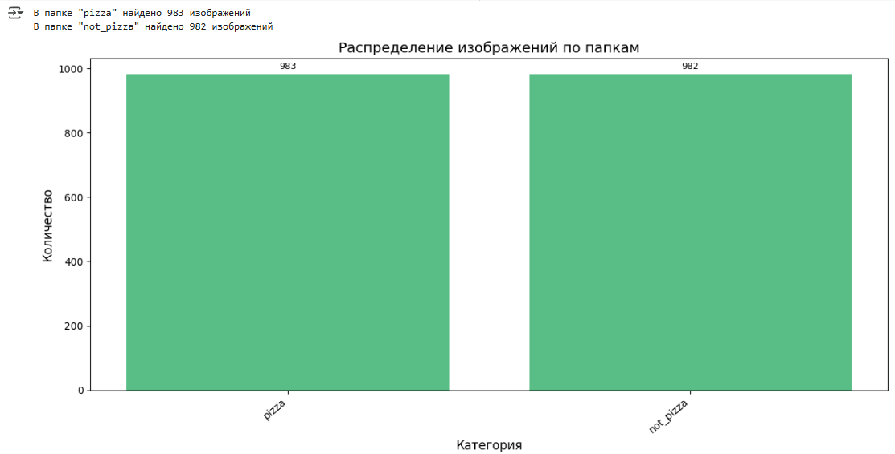

# lab_4

Лабораторная работа 4

Цель настоящей работы состоит в том, чтобы построить архитектур  рекуррентных нейронных сетей, которые позволяют решить практическую задачу с высокими показателями качества.

Задачи

Выполнение практической работы предполагает решение следующих задач:

1. Разработка нескольких архитектур рекуррентных  нейронных сетей.

2. Обучение разработанных глубоких моделей.

3. Тестирование обученных глубоких моделей.

4. Сравнение полученных результатов с результатами 3 лабораторной работы.

5. Публикация разработанных программ/скриптов в личном репозитории на GitHub. (по желанию)

6. Подготовка отчета, содержащего минимальный объем информации по каждому этапу выполнения работы.

Код [ссылка](Лаб4.ipynb)

Отчет [ссылка]()

Для работы Было использовано подмножество набора данных Food-101. (Bossard, Lukas, Matthieu Guillaumin и Luc Van Gool. "Food-101 – Mining Discriminative Components with Random Forests") https://www.kaggle.com/datasets/carlosrunner/pizza-not-pizza Изображения находятся в папке "img" в двух папках, "pizza" и "not_pizza", в каждой папке 983 файла с изображениями.

